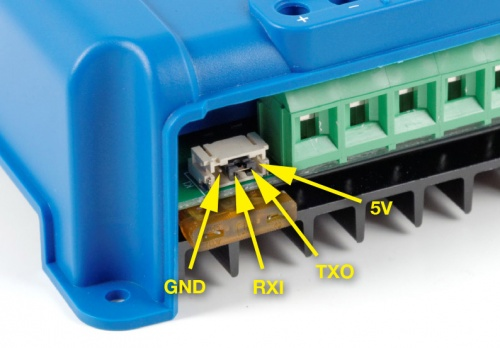

# VeDirectDecode Arduino Library

A fast Arduino library to decode serial data adhering to the VE.Direct protcol from Victron Energy devices.

It was created as the existing libraries seemed extremely slow. VeDirectDecode takes ~0.9ms for getData() to complete on a P1AM-100 (~Arduino MKR Zero) device.

Tested mainly on several Victron Energy SmartSolar MPPT 75/10 and 75/15 devices but should work with any Victron Energy device that uses the VE.Direct protocol.

MCU's tested:

- Arduino MKR Zero
- Arduino MKR WIFI 1010
- Arduino MKR WAN 1310
- AutomationDirect P1AM-100

## Overview

**NOTE:** The Victron Energy devices are 3.3v. If you are using a 5v Arduino you must use a 5V to 3.3V logic level converter.

### Interface

- Read any parameter you would like with the getParam() function
- Read a bunch of usefull parameters with the getData() function

### Example

```C
#include "VeDirectDecode.h"

void setup(){
    VeDirectDecode test{&Serial1};

    int32_t batVoltage = 0;
    int32_t batCurrent = 0;
    int32_t loadCurrent = 0;
    int32_t loadState = 0;
    int32_t panelVoltage = 0;
    int32_t panelPower = 0;
    int32_t converterState = 0;
    int32_t maxPowerToday = 0;

    while(1){
        test.getData(batVoltage, batCurrent, loadCurrent, loadState, panelVoltage, panelPower, converterState, maxPowerToday);
    }
}
```

## Wiring info

Pinout for the serial connector on the VE.Direct cable:



Both an USB-adapter and RS-232 DB9 cable can be purchased from Victron. For DIY cables the 4-pin JST PH 2.0 connector is used.

Commong cable pinout for Victron Energy VE.Direct cables:


## Resources

- [Victron Energy VE.Direct Protocol](https://www.victronenergy.com/live/vedirect_protocol:faq)
- [Victron Energy VE.Direct Protocol Whitepaper](https://www.victronenergy.com/upload/documents/Whitepaper-Data-communication-with-Victron-Energy-products_EN.pdf)
- [Victron Energy VE.Direct Protocol List of Parameters](https://www.victronenergy.com/live/vedirect_protocol:appendix_a)
- [Victron Energy VE.Direct Protocol List of Products](https://www.victronenergy.com/live/vedirect_protocol:appendix_b)
- [Victron Energy VE.Direct Protocol List of Error Codes](https://www.victronenergy.com/live/vedirect_protocol:appendix_c)
